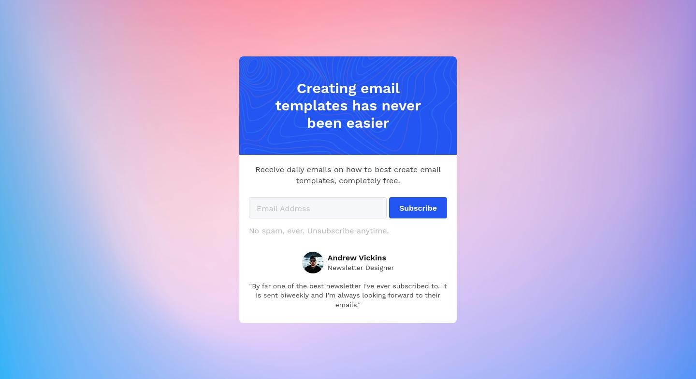

# Newsletter Popup Challenge from Codewell

  
  
  
  

  

## Feedback and Live Review
* [🌐 Live Review](https://vanzanewsletter.netlify.app/)
* [👉 Give your thoughts on Codewell]()
* [👉 Give your thoughts on Twitter]()

## Screenshot

## Table of contents
- [Intro](#intro)
- [Story](#the-story-when-doing-this-challenge)
- [What I Learned](#what-i-learned)
- [Technology that I used](#built-with)
- [Useful Resources](#useful-resources)
- [Continued Development](#continued-development)

## Intro
This is one of the challenge from [Codewell](https://www.codewell.cc). Codewell's aim is to provide you with real-world design templates that you can use to practice your HTML and CSS projects.

You can also practice your JavaScript by adding JavaScript if you want. Like for example, in this challenge you can try to create a form validation using Vanilla JavaScript.

Since, I don't have a good knowledge on JavaScript yet, I don't use any JavaScript in this project.

## The Story When Doing This Challenge
The layout for the card is pretty straight forward, so nothing special for it. But, the interesting part was, when I wanted to make the card responsive. I should make it not full width anymore, which was a unique thing in my opinion.

I ended making the body doing flexbox things to make the card center and added `max-width` to the card to prevent getting larger on bigger screen.

## Built With
This project is created using **HTML5**, **CSS3**, and **Sass**. I also created a simple form validation using HTML and CSS.

I uploaded this to Netlify and used one of the form features from [Netlify which was Forms Spam Filters](https://docs.netlify.com/forms/spam-filters/), using **Honeypot field**.

  
  
  
  

## Useful Resources
* [Medium Article about Accessibility and Touch Targets by Zac Dickerson](https://medium.com/@zacdicko/size-matters-accessibility-and-touch-targets-56e942adc0cc)
* [Optimize Cumulative Layout Shift](https://web.dev/optimize-cls/)
* [Form Validation UX in HTML and CSS](https://css-tricks.com/form-validation-ux-html-css/)
* [Font Converter from any format to any format that you want](https://www.fontconverter.io/en)

## Continued development
I will take people feedback and improve this solution.